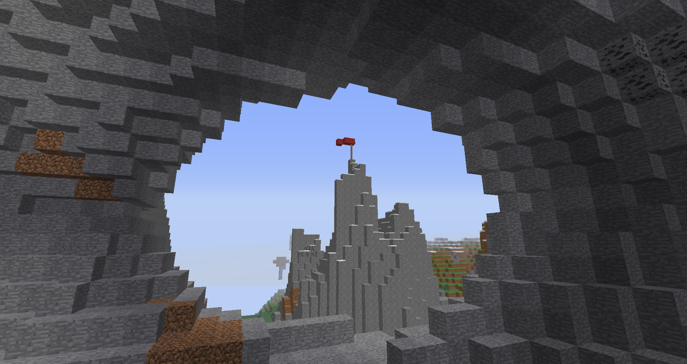

# A Flag on a Mountain
These are resources related to finding the seed of my 2014 Flag on a Mountain screenshot, the fifth-oldest screenshot I still have.

To the best of my memory, the screenshot is of a randomly-generated world, meaning there are 2^48 possible seeds. 
Under the assumption I didn't fly more than 10000 blocks from the world origin, I made a recreation of the screenshot, then used the visible snow levels to narrow the possible coordinates down to 20 candidates (which all fell along one of three chunk alignments). 
The next step is to try to use the visible dirt and coal veins to determine which internal seed generated them, then ideally use that and the coordinates to derive the original world seed.

I would also like to turn my snow brute-forcer into a generalized coordinate-finding tool at some point, but this hasn't been finished yet.